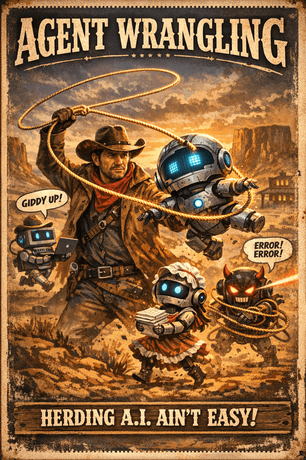

# Lasso

<p align="center">
  
</p>

Lasso is a dynamic harness engine built on `pi-duroxide`. It goes from intent to
executable workflow — and repairs the harness while it runs.

```text
Intent
  → Environment discovery (tools, resources, constraints)
  → Memory query (past patterns, what worked/failed)
  → Graph synthesis (planner + capabilities)
  → Failure prediction (auth, tool, network, resource)
  → Policy synthesis (mutations: add verification, retry, approval)
  → Compilation (validate → lower → optimize → execute)
  → Runtime adaptation (trace → mutate → continueAsNew)
```

If `pi-duroxide` is the durable runtime engine, **Lasso is the layer that
generates, optimizes, and repairs the harnesses that run on it**.

## Quick start

```bash
# Run from this repository
pi -e ./src/index.ts

# Or install into pi
pi install .
```

Then, inside pi:

```bash
# 1. Plan a workflow from a freeform brief
/lasso:plan Validate that the bug fix in fix.patch works against main

# 2. Run it against a disposable worktree
/lasso:run {"workflow":"patch-validation","input":{...}}

# 3. Inspect what happened
/lasso:inspect
```

> **Safety:** Lasso checks out refs, applies patches, and merges branches in the
> target repo. Use a throwaway clone or disposable worktree, not your primary
> checkout.

## Table of contents

- [Why Lasso exists](#why-lasso-exists)
- [What Lasso does](#what-lasso-does)
- [How it works](#how-it-works)
- [Slash commands](#slash-commands)
- [Bundled workflows](#bundled-workflows)
- [Request examples](#request-examples)
- [Custom workflows](#custom-workflows)
- [HarnessSpec reference](#harnessspec-reference)
- [Library API](#library-api)
  - [Compiler](#compiler)
  - [Compiler feedback](#compiler-feedback)
  - [Verification engine](#verification-engine)
  - [Compiler optimizations](#compiler-optimizations)
  - [Harness mutations](#harness-mutations)
  - [Guardrails](#guardrails)
  - [Failure mode generation](#failure-mode-generation)
  - [Adaptive runtime](#adaptive-runtime)
  - [Lineage persistence](#lineage-persistence)
  - [Harness memory](#harness-memory)
  - [Environment model](#environment-model)
  - [Failure ontology](#failure-ontology)
  - [Capabilities](#capabilities)
  - [Meta-harness](#meta-harness)
  - [Multi-harness composition](#multi-harness-composition)
- [How Lasso fits with pi-duroxide](#how-lasso-fits-with-pi-duroxide)
- [Non-goals](#non-goals)

---

## Why Lasso exists

`pi-duroxide` gives you a durable workflow runtime. That is the right layer when
you already know what workflow you want to run.

Lasso sits one level higher. It:

1. **discovers** the execution environment (available tools, auth, constraints)
2. **synthesizes** a workflow graph from intent
3. **predicts** failures before they happen
4. **mutates** the harness to prevent them
5. **compiles** into a replay-safe durable workflow
6. **repairs** the harness at runtime based on observed failures
7. **remembers** what worked across sessions

Use Lasso when you want workflow automation that is:

- more reusable than an ad hoc prompt
- more inspectable than hidden agent logic
- safer to validate before execution
- adaptive — it repairs itself when things go wrong
- aware of its environment — it knows what tools are available

## What Lasso does

Lasso takes a declarative `HarnessSpec`, validates it, lowers it to CIR,
optimizes it, and compiles it into a replay-safe workflow that runs on
`pi-duroxide`.

Out of the box, it ships with:

- **Two bundled workflows** — `patch-validation` and `pr-review-merge`
- **Slash commands** — `/lasso:plan`, `/lasso:replan`, `/lasso:compile`, `/lasso:run`, `/lasso:inspect`
- **A library API** — for programmatic use from TypeScript

## How it works

### The generation pipeline

```text
Intent (brief or skill markdown)
  ↓
parsePromptOrSkill() → IntentIR
  ↓
buildTaskGraph() → TaskGraph
  ↓
analyzeRisks() → RiskModel
  ↓
synthesizePolicy() → PolicyBundle
  ↓
synthesizeHarness() → HarnessSpec
  ↓
compileHarnessSpec() → CompiledWorkflow → pi-duroxide
```

### The adaptation loop

```text
Workflow executes
  ↓
Execution trace captured (timestamps, I/O snapshots, failures)
  ↓
deriveMutationsFromTrace() → HarnessMutation[]
  ↓
mutateHarness(spec, mutations) → new spec
  ↓
prepareRuntimeReplan() → continue_as_new / needs_operator_input / stop
  ↓
New version with repaired harness
```

### The feedback loop

```text
compileHarnessSpec()
  ↓
analyzeCompiledWorkflow()
  → CostEstimate (LLM calls, duration, USD)
  → RiskAssessment (cost, failure, quality, complexity)
  → HarnessMutation[] (executable, with triggers)
  ↓
mutateHarness(spec, mutations)
  → replace expensive models
  → add retry policies
  → add verification hooks
  ↓
Recompile with improvements
```

---

## Slash commands

| Command | Use it when | What it does |
| --- | --- | --- |
| `/lasso:plan <brief>` | You have an English brief and want a draft request | Returns a draft JSON request or a clarification result |
| `/lasso:replan <JSON>` | You have a previous request plus a real outcome | Returns a revised draft, `needs_operator_input`, or `stop` |
| `/lasso:compile <input>` | You want to inspect what Lasso will register | Compiles and stores the artifact in memory |
| `/lasso:run <input>` | You want to execute a workflow locally | Compiles, registers, and starts the workflow |
| `/lasso:inspect [name]` | You want to see compiled spec, CIR, and runtime state | Shows the latest or named compiled workflow |

### `/lasso:plan`

Deterministic, draft-only. Classifies a brief into `patch-validation`,
`pr-review-merge`, or `custom` and returns a draft JSON envelope you can pass to
`/lasso:compile` or `/lasso:run`. Does not compile, register, or run anything.

For the two bundled families, it extracts structured fields with strict
validation. For custom families (via skill markdown with an explicit `workflow`
name), it builds a sequential graph from parsed steps.

### `/lasso:replan`

Deterministic, draft-only. Accepts the original request plus an
`observedOutcome` and returns one of:

1. a revised draft request
2. `needs_operator_input` — human must provide new facts
3. `stop` — auto-retrying would be wrong

### Custom compile/run input shapes

`/lasso:compile` and `/lasso:run` accept four input forms:

1. **Bundled workflow request JSON** — `{ "workflow": "patch-validation", "input": {...} }`
2. **Raw `HarnessSpec` JSON** — the full spec
3. **Envelope with spec or specPath** — `{ "spec": {...}, "input": {...} }` or `{ "specPath": "/path/to/spec.json" }`
4. **Direct path** — `/tmp/custom-spec.json`

---

## Bundled workflows

Both operate entirely against a **local** repository or worktree.

### `patch-validation`

Validates a candidate fix against a known-bad baseline:

1. Check out `baselineRef` and run `reproduceCommands` to confirm the bug
2. Apply the candidate from `candidateSource`
3. Re-run `reproduceCommands` — expect them to pass
4. Run `verificationCommands` as a broader regression check
5. Optionally route to human approval

Terminal outcomes: `validated-fix`, `not-reproduced`, `apply-failed`, `candidate-failed`, `rejected`

### `pr-review-merge`

Local rehearsal of a review-and-merge flow:

1. Inspect the repo
2. Run verification commands
3. Generate an LLM review summary
4. Route through human approval
5. Perform local merge
6. Re-run verification after merge

---

## Request examples

### `patch-validation`

```json
{
  "workflow": "patch-validation",
  "input": {
    "repoPath": "/absolute/path/to/disposable-worktree",
    "baselineRef": "main",
    "candidateSource": { "kind": "patchFile", "value": "/path/to/fix.patch" },
    "reproduceCommands": ["npm test -- --grep 'the broken test'"],
    "verificationCommands": ["npm test"],
    "reviewInstructions": "Approve if the patch applies cleanly and verification passes.",
    "approvalRequired": false
  }
}
```

### `pr-review-merge`

```json
{
  "workflow": "pr-review-merge",
  "input": {
    "repoPath": "/absolute/path/to/disposable-worktree",
    "sourceBranch": "feature/pr-change",
    "targetBranch": "main",
    "reviewInstructions": "Approve only if verification passes and the diff looks safe.",
    "verificationCommands": ["node -e \"process.exit(0)\""]
  }
}
```

### `replan`

```json
{
  "workflow": "patch-validation",
  "originalRequest": {
    "workflow": "patch-validation",
    "input": { "..." : "..." }
  },
  "observedOutcome": {
    "terminalNodeId": "validated-fix",
    "notes": ["prod hotfix"]
  }
}
```

For aborted attempts: `{ "aborted": true, "abortReason": "retry-exhaustion" }`

### Custom `HarnessSpec` compile

```json
{
  "name": "custom-echo",
  "graph": {
    "entryNodeId": "echo",
    "nodes": [
      { "id": "echo", "kind": "tool", "tool": "bash", "args": ["-lc", "echo hello"] }
    ],
    "edges": []
  }
}
```

---

## Custom workflows

Use `/lasso:compile` and `/lasso:run` with any `HarnessSpec`, or use Lasso as
a library:

```typescript
import { validateHarnessSpec, lowerHarnessSpecToCir, compileHarnessSpec } from "lasso";

validateHarnessSpec(spec);       // structural validation
lowerHarnessSpecToCir(spec);     // inspect lowered IR
compileHarnessSpec(spec);        // produce replay-safe workflow
```

Arbitrary workflow families are supported. The planner accepts custom families
via skill markdown with an explicit `workflow` name.

---

## HarnessSpec reference

Canonical sources: `src/spec/types.ts`, `src/spec/schema.ts`, `src/spec/validate.ts`

### Top-level shape

```json
{
  "name": "workflow-name",
  "graph": { "entryNodeId": "start", "nodes": [], "edges": [] },
  "executionPolicy": {},
  "humanPolicy": {},
  "observabilityPolicy": {}
}
```

| Field | Required | Type | Notes |
| --- | --- | --- | --- |
| `name` | Yes | `string` | Unique workflow name |
| `graph` | Yes | `object` | Contains `entryNodeId`, `nodes`, `edges` |
| `executionPolicy` | No | `object` | Global execution settings |
| `humanPolicy` | No | `object` | Human interaction defaults |
| `observabilityPolicy` | No | `object` | Trace / metrics / logging |

All top-level objects are **strict**. Unknown fields are rejected.

### Node kinds

| Kind | Key fields | Maps to |
| --- | --- | --- |
| `tool` | `tool`, `args`, `env`, `cwd` | `ctx.pi.tool()` |
| `llm` | `provider`, `model`, `prompt`, `system` | `ctx.pi.llm()` |
| `human` | `prompt`, `interactionType`, `options` | `ctx.waitForEvent()` |
| `condition` | `condition`, `thenNodeId`, `elseNodeId` | Branch evaluation |
| `merge` | `waitFor`, `strategy` | Fork-join synchronization |
| `subworkflow` | `specRef`, `inputs` | `ctx.scheduleSubOrchestration()` |

### Validation rules

1. Node IDs must be unique
2. `entryNodeId` must exist
3. Every edge `from`/`to` must reference an existing node
4. `condition.thenNodeId` and `condition.elseNodeId` must exist
5. `merge.waitFor` must not be empty
6. `human` nodes with `interactionType: "choice"` must have `options`
7. Unreachable nodes are rejected
8. `retryPolicy` only on `tool`, `llm`, `subworkflow`
9. Verification rules cannot reference missing nodes
10. Circular verification dependencies are rejected

---

## Library API

### Compiler

```typescript
import { compileHarnessSpec, type CompiledHarnessWorkflow } from "lasso";

const compiled = compileHarnessSpec(spec);
// compiled.name, compiled.spec, compiled.cir, compiled.optimizations
// compiled.register(pi) — registers with pi-duroxide
```

Pipeline: validate → lower → optimize → validate CIR → build generator.

### Compiler feedback

Analyzes compiled workflows and emits **executable mutations** (not just
advisory suggestions):

```typescript
import { analyzeCompiledWorkflow, mutateHarness } from "lasso";

const analysis = analyzeCompiledWorkflow(compiled);
// analysis.cost — LLM calls, duration, USD estimate
// analysis.risk — cost, failure, quality, complexity
// analysis.mutations — executable HarnessMutation[] with triggers

// Apply mutations directly
const { spec: improvedSpec } = mutateHarness(spec, analysis.mutations);
```

Each mutation carries a `trigger` (why it was emitted) and `description`
(human-readable reason):

| Trigger | Mutation | Effect |
| --- | --- | --- |
| `cost_high` | `replace-node` | Swap expensive model for cheaper one |
| `retry_exhausted` | `modify-node` | Add retry policy with exponential backoff |
| `verification_failed` | `add-verification` | Add verification hook |
| `loop_detected` | `modify-node` | Flag adjacent nodes for merge |

### Guardrails

Enforce execution limits at runtime. The compiler stops execution when limits
are exceeded, throwing a `GuardrailExceededError` with a descriptive message.

```json
{
  "name": "limited-workflow",
  "executionPolicy": {
    "maxSteps": 25,
    "costLimitUsd": 0.25,
    "timeout": 300000
  },
  "graph": { "..." : "..." }
}
```

| Field | Type | Enforcement |
| --- | --- | --- |
| `maxSteps` | `number` (positive integer) | Stops after N node executions |
| `costLimitUsd` | `number` (positive) | Stops when estimated LLM cost exceeds limit |
| `timeout` | `number` (ms) | Stops after wall-clock time |

Step count resets on `continueAsNew` (adaptive evolution). Cost accumulates
across versions.

### Failure mode generation

Before execution, Lasso generates plausible failure modes from the task
description and environment. This answers "Where am I likely to fail?" before
acting.

```typescript
import { generateFailureModes } from "lasso";

const generation = generateFailureModes("Deploy my app to staging", env);
// generation.failureModes — array of FailureMode
// generation.riskSummary — "HIGH RISK: auth failures likely (env constraint detected)"
```

| Task keyword | Generated failure modes |
| --- | --- |
| `deploy` | auth expiry, network timeout, config drift |
| `test` | flaky tests, timeout, environment mismatch |
| `build` | dependency failure, disk full, OOM |
| `merge` | conflict, verification failure |
| `database` | connection timeout, migration failure |
| `api` | rate limit, auth expiry, schema mismatch |
| `file` | permission denied, disk full, path not found |

Failure modes are cross-referenced with environment constraints: if auth
constraint detected, auth failure probability is boosted. Each mode includes
triggers, mitigations, and recovery actions.

### Verification engine

Standalone module with compositional strategies:

```typescript
import { runVerification } from "lasso/verification/engine";

// Strategies: "all-must-pass" (default), "first-pass", "any-block"
const report = yield* runVerification(nodeId, hooks, nodeMap, state, ctx, "first-pass");
// report.overallStatus — "pass" | "warn" | "block"
// report.hookResults — per-hook outcome + duration
```

### Compiler optimizations

Three passes between lowering and CIR validation:

1. **Dead-node elimination** — removes unreachable nodes
2. **Single-branch merge elision** — simplifies single-branch merges
3. **Tool-node fusion** — merges adjacent `bash`/`sh` nodes

```typescript
import { optimizeCirWorkflow } from "lasso/cir/optimize";

const { optimized, passes } = optimizeCirWorkflow(cir);
// passes — ["dead-node-elimination", "merge-elision", "tool-fusion"]
```

### Harness mutations

Structural spec modifications from execution traces or compiler feedback:

```typescript
import { deriveMutationsFromTrace, deriveMutationsFromFailure, mutateHarness } from "lasso";

// From execution trace
const mutations = deriveMutationsFromTrace(trace, spec);

// From classified failure
const mutations = deriveMutationsFromFailure(signature, spec, { nodeId: "deploy" });

// Apply
const { spec: newSpec, diff } = mutateHarness(spec, mutations);
```

Mutation types: `add-node`, `remove-node`, `modify-node`, `add-edge`,
`toggle-approval`, `add-verification`, `replace-node`, `tighten-guardrail`

Triggers: `node_failed`, `confidence_low`, `cost_high`, `loop_detected`,
`retry_exhausted`, `verification_failed`, `tool_missing`, `auth_expired`

### Adaptive runtime

Reference workflows get automatic version evolution:

```typescript
import { prepareRuntimeReplan, MAX_ADAPTIVE_VERSIONS } from "lasso";

const decision = await prepareRuntimeReplan(metadata, input, result);
// decision.type — "continue_as_new" | "needs_operator_input" | "stop"
```

Capped at 5 versions (`MAX_ADAPTIVE_VERSIONS`). Each version records a
`HarnessVersion` with full lineage.

### Lineage persistence

```typescript
import { FileLineageStore } from "lasso";

const store = new FileLineageStore("/path/to/store");
await store.saveVersion(version);
await store.saveLineage(entry);

const chain = await store.getLineageChain(3);
const recent = await store.queryLineage({ terminalNodeId: "validated-fix", limit: 10 });
```

### Harness memory

Tracks patterns across sessions:

```typescript
import { FileMemoryStore, adviseFromMemory } from "lasso";

const store = new FileMemoryStore("/path/to/memory");
const advice = await adviseFromMemory("deploy-staging", store);
// advice.suggestions — "Previously, auth-check-before-deploy improved success rate"
// advice.warnings — "Pattern deploy-without-auth failed 6 times"
```

### Environment model

Discovers execution environment before generating a harness:

```typescript
import { discoverEnvironment, analyzeEnvironment } from "lasso";

const env = await discoverEnvironment("/path/to/repo");
// env.tools — bash, git, node, etc.
// env.constraints — auth, network, rate-limit
// env.repoState — branch, uncommitted changes, remotes

const analysis = analyzeEnvironment(env, ["git", "node"]);
// analysis.readinessScore — 0-100
// analysis.preparatorySteps — actionable prep steps
```

### Failure ontology

7 failure classes with evidence and recovery:

```typescript
import { classifyFailure, suggestRecovery } from "lasso";

const signature = classifyFailure(error, { nodeId: "deploy" });
// signature.class — "auth" | "tool" | "resource" | "semantic" | "human" | "environment-drift" | "network" | "unknown"
// signature.confidence — 0-1
// signature.suggestedRecovery — actionable steps

const recovery = suggestRecovery(signature);
```

### Capabilities

Dynamic graph generation from required tools:

```typescript
import { DefaultCapabilityRegistry, planWorkflowRequest } from "lasso";

const registry = new DefaultCapabilityRegistry();
// Pre-registered: bash, git, node, llm-review, human-approval

const result = planWorkflowRequest(brief, registry);
```

### Meta-harness

Full generation pipeline — discover, predict, synthesize, compile:

```typescript
import { DefaultMetaHarness, DefaultCapabilityRegistry, FileMemoryStore } from "lasso";

const meta = new DefaultMetaHarness({
  capabilityRegistry: new DefaultCapabilityRegistry(),
  memoryStore: new FileMemoryStore("/path/to/memory"),
});

const result = await meta.generateHarness("Deploy my app to staging");
// result.spec — generated HarnessSpec
// result.environmentAnalysis — tool/resource availability
// result.predictedFailures — anticipated failures with confidence
// result.compilerAnalysis — cost, risk, mutations
// result.readinessScore — 0-100
// result.appliedMutations — what was changed
```

### Multi-harness composition

```typescript
// Sequential chain
const chained = meta.composeHarnesses([
  { name: "research", spec: researchSpec },
  { name: "plan", spec: planSpec },
  { name: "execute", spec: executeSpec },
]);

// Parallel execution
const parallel = meta.composeParallel([verificationSpec, notificationSpec]);

// Conditional branching
const conditional = meta.composeConditional("isProduction", prodSpec, stagingSpec);
```

Node IDs are prefixed with stage names to avoid collisions.

---

## How Lasso fits with pi-duroxide

- `pi-duroxide` owns workflow lifecycle, replay, timers, events, and runtime registration
- Lasso owns spec validation, CIR lowering, optimization, compilation, and operator-facing commands

In other words: `pi-duroxide` is the durable runtime engine; Lasso is the
harness generation, optimization, and adaptation layer built on top of it.

## Non-goals

Lasso does **not** currently aim to provide:

- live GitHub or `gh` integration
- autonomous code authoring or patch generation
- LLM-backed planning or replanning (all planning is deterministic)
- automatic compile/run behavior from `/lasso:plan` or `/lasso:replan`
- arbitrary generated TypeScript
